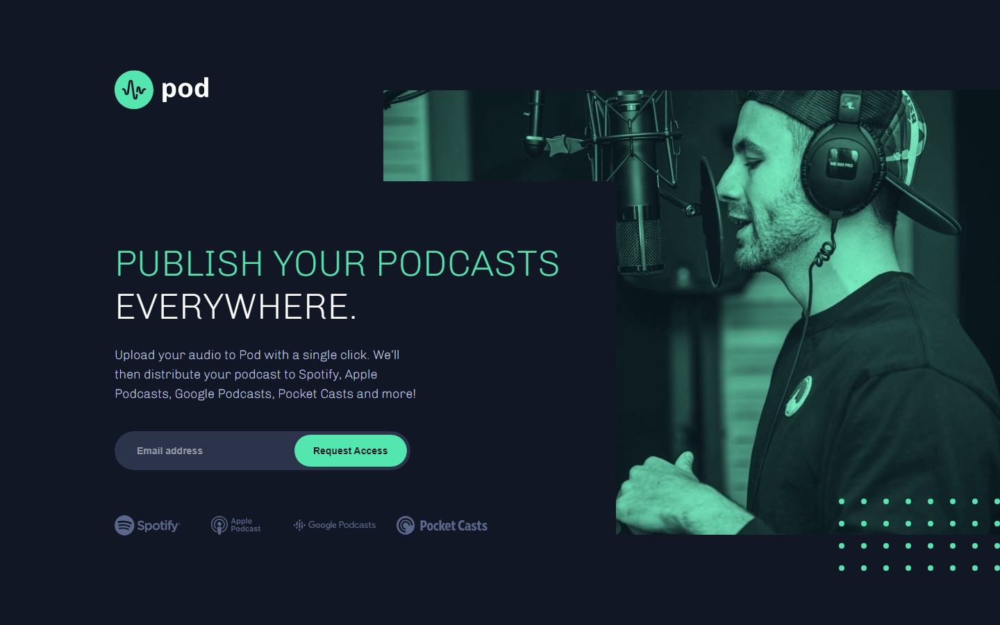

# Frontend Mentor - Pod request access landing page solution

This is a solution to the [Pod request access landing page challenge on Frontend Mentor](https://www.frontendmentor.io/challenges/pod-request-access-landing-page-eyTmdkLSG). Frontend Mentor challenges help you improve your coding skills by building realistic projects.

## Table of contents

- [Frontend Mentor - Pod request access landing page solution](#frontend-mentor---pod-request-access-landing-page-solution)
  - [Table of contents](#table-of-contents)
  - [Overview](#overview)
    - [The challenge](#the-challenge)
    - [Screenshot](#screenshot)
    - [Links](#links)
  - [My process](#my-process)
    - [Built with](#built-with)
    - [What I learned](#what-i-learned)
    - [Useful resources](#useful-resources)
  - [Author](#author)

**Note: Delete this note and update the table of contents based on what sections you keep.**

## Overview

### The challenge

Users should be able to:

- View the optimal layout depending on their device's screen size
- See hover states for interactive elements
- Receive an error message when the form is submitted if:
  - The `Email address` field is empty should show "Oops! Please add your email"
  - The email is not formatted correctly should show "Oops! Please check your email"

### Screenshot

### Links

- Solution URL: [Add solution URL here](https://your-solution-url.com)
- Live Site URL: [Add live site URL here](https://your-live-site-url.com)

## My process

### Built with

- Semantic HTML5 markup
- CSS custom properties
- Flexbox
- Mobile-first workflow
- [Sass](https://sass-lang.com/)

### What I learned

The biggest challenge was creating an HTML that would allow me to transition from mobile-first to desktop without too many headaches. Unfortunately, that wasn't the case, and as a result, I had to resort to certain 'workarounds' to adjust the layout.

### Useful resources

- [The 7-1 Pattern](https://www.educative.io/courses/sass-for-css/the-7-1-pattern) - This article helped me a lot to organize my Sass folders.

## Author

- Website - [Diogo Luxa](https://dlxagency.online/)
- Frontend Mentor - [@DiogoLuxa](https://www.frontendmentor.io/profile/DiogoLuxa)
- Twitter - [@DiogoLuxa](https://twitter.com/DiogoLuxa)
